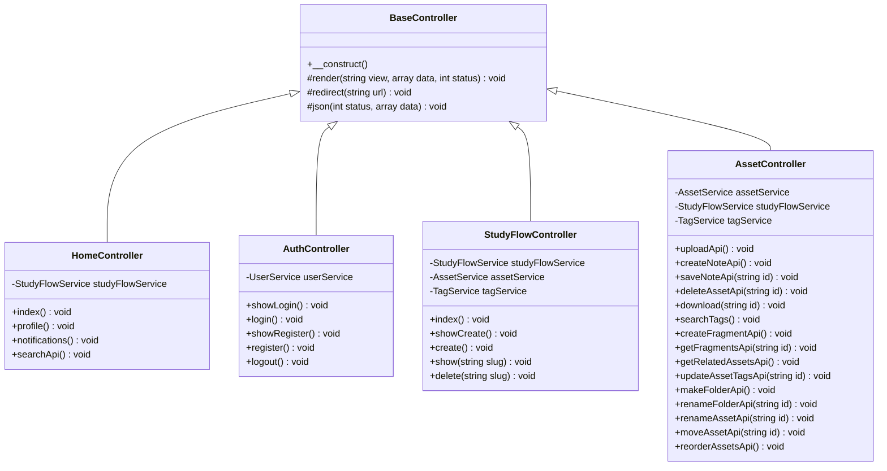
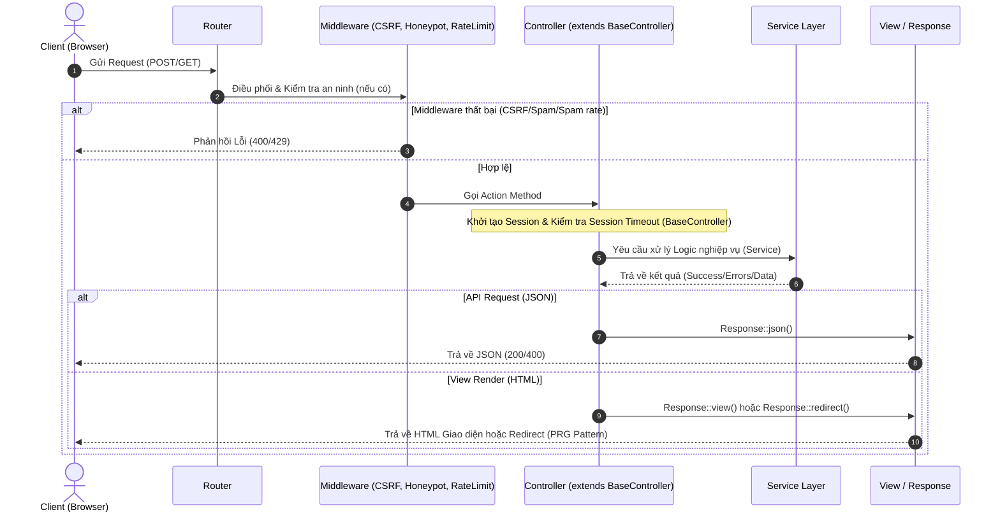

# Báo cáo Cấu trúc Controllers - StudyFlow Hub

Tài liệu này mô tả chi tiết kiến trúc, vai trò, các method và cơ chế bảo mật được áp dụng tại tầng **Controller** trong dự án **StudyFlow Hub**.

---

## 1. Sơ đồ Kiến trúc & Luồng Xử lý (Mermaid Diagram)

Dưới đây là sơ đồ kế thừa Class của các Controller và cách chúng tương tác với Middleware, Service và View/Response:

### Luồng xử lý một Request đi qua Controller:

---

## 2. Chi tiết các Controllers

### 2.1. BaseController
*   **Namespace:** `StudyFlow\Controllers`
*   **Vai trò:** Controller cha thiết lập cấu hình chung và cung cấp các hàm trợ giúp (helper) cho tất cả các controller con.
*   **Hành vi chính trong Constructor:**
    *   Kích hoạt Session thông qua `Session::start()`.
    *   Bảo mật session tự động qua `Session::checkSessionTimeout()` (hết hạn hoạt động) và `Session::checkSessionContext()` (chống đánh cắp Session ID).
*   **Các Method hỗ trợ:**
    *   `render(string $view, array $data = [], int $status = 200)`: Render view HTML.
    *   `redirect(string $url)`: Chuyển hướng trang.
    *   `json(int $status, array $data)`: Trả về dữ liệu định dạng JSON.

### 2.2. HomeController
*   **Vai trò:** Điều phối trang chủ công cộng, trang cá nhân và các API tìm kiếm/thông báo cơ bản.
*   **Các Method:**
    *   `index()`: Hiển thị trang chủ chính gồm danh sách các StudyFlow nổi bật (Trending) và mới nhất (Newest), kèm theo các tag phổ biến.
    *   `profile()`: Hiển thị trang hồ sơ cá nhân của người dùng đã đăng nhập.
    *   `notifications()`: Tích hợp với **HTMX** để trả về HTML danh sách thông báo mới và tự động cập nhật notification dot thông qua trigger header `HX-Trigger`.
    *   `searchApi()`: API tìm kiếm toàn cầu cho hệ thống.

### 2.3. AuthController
*   **Vai trò:** Quản lý quy trình đăng nhập, đăng ký và đăng xuất của người dùng.
*   **Bảo mật tích hợp:**
    *   **Honeypot & CSRF:** Tích hợp kiểm tra chống spam bot và giả mạo request thông qua `HoneypotMiddleware` và `CsrfMiddleware`.
    *   **Rate Limiting:** Giới hạn tần suất đăng nhập (tối đa 5 lần/30s) và đăng ký (tối đa 3 lần/60s).
    *   **Quy tắc render:** Khi đăng nhập/đăng ký thất bại, controller không redirect (tránh mất sticky form data) mà render trực tiếp kèm lỗi.
*   **Các Method:**
    *   `showLogin()` / `login()`: Hiển thị và xử lý đăng nhập.
    *   `showRegister()` / `register()`: Hiển thị và xử lý đăng ký tài liệu khoản.
    *   `logout()`: Đăng xuất người dùng một cách an toàn (yêu cầu xác thực CSRF).

### 2.4. StudyFlowController
*   **Vai trò:** Quản lý các StudyFlow (không gian học tập) của người dùng.
*   **Yêu cầu:** Tất cả các action đều yêu cầu đăng nhập thông qua `Session::requireLogin()`.
*   **Các Method:**
    *   `index()`: Hiển thị danh sách các StudyFlow có phân trang, tìm kiếm và sắp xếp động.
    *   `showCreate()` / `create()`: Hiển thị form tạo và xử lý thêm StudyFlow mới (áp dụng Honeypot, CSRF).
    *   `show(string $slug)`: Hiển thị chi tiết không gian StudyFlow. Lấy toàn bộ notes, resources (tải trực tiếp qua S3/MinIO presigned URL), phân nhóm thư mục và quản lý tags tương ứng.
    *   `delete(string $slug)`: Xóa StudyFlow (kiểm tra quyền sở hữu và CSRF).

### 2.5. AssetController
*   **Vai trò:** Quản lý toàn bộ tài nguyên học tập (tệp tin tải lên, ghi chú markdown, thư mục ảo, phân mảnh ghi chú).
*   **Đặc điểm:** Hoạt động như một API Controller chính để tương tác thời gian thực với giao diện Workspace.
*   **Các Method tiêu biểu:**
    *   `uploadApi()`: Tải lên tài liệu học tập (giới hạn file 25MB, kiểm tra mime-type và tự động tạo tag mặc định).
    *   `createNoteApi()` / `saveNoteApi()`: Lưu trữ và cập nhật nội dung ghi chú Markdown.
    *   `makeFolderApi()` / `renameFolderApi()` / `moveAssetApi()`: Tổ chức cấu trúc thư mục ảo trong workspace.
    *   `reorderAssetsApi()`: Lưu trữ thứ tự sắp xếp kéo thả của các tài nguyên.
    *   `createFragmentApi()` / `getFragmentsApi()`: Hỗ trợ tính năng NoteBench (trích xuất vùng PDF/Hình ảnh kèm text/bounding box để đính kèm vào Note).

---

## 3. Các Nguyên Tắc Thiết Kế Áp Dụng (Design Standards)

1.  **Slim Controller:** Toàn bộ logic nghiệp vụ (lưu file vật lý, mã hóa mật khẩu, truy vấn SQL phức tạp, cấu trúc cây thư mục) được đẩy xuống tầng **Service** (`UserService`, `AssetService`, `StudyFlowService`). Controller chỉ đóng vai trò nhận request, xác thực trung gian và trả về response.
2.  **PRG Pattern (Post-Redirect-Get):** Khi thao tác POST (như đăng ký tài khoản, tạo StudyFlow) thành công, hệ thống sử dụng `redirect()` để chuyển hướng sang GET nhằm tránh hiện tượng resubmit form khi người dùng nhấn F5.
3.  **Sticky Forms:** Lưu lại giá trị cũ của form (`old`) qua session/biến để hiển thị lại khi validate thất bại, nâng cao trải nghiệm người dùng.
4.  **Bảo mật tầng Middleware:** Middleware được gọi một cách tường minh bên trong action của Controller (ví dụ: `CsrfMiddleware::handle()`) để đảm bảo tính minh bạch và dễ kiểm soát luồng dữ liệu.
