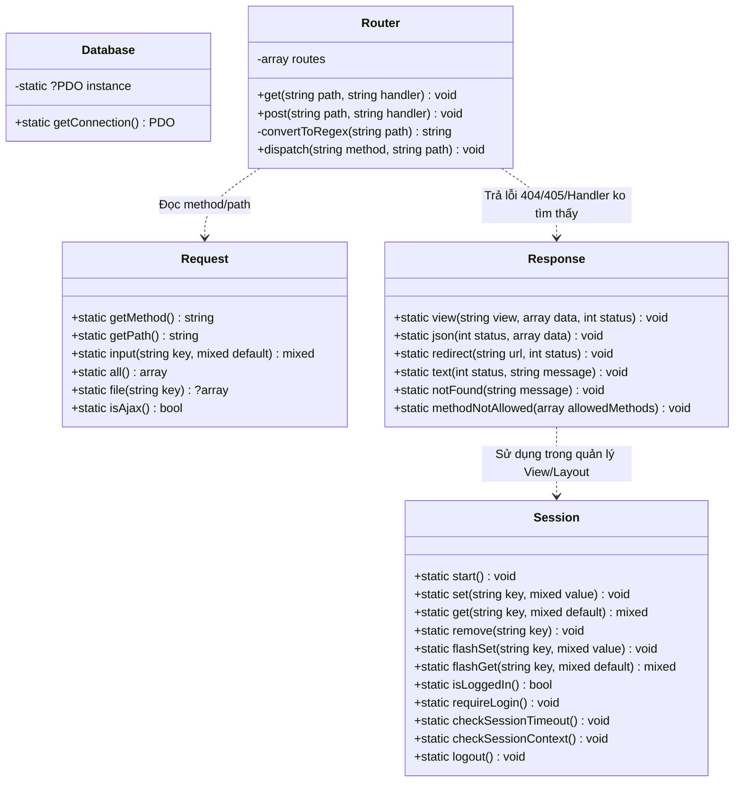
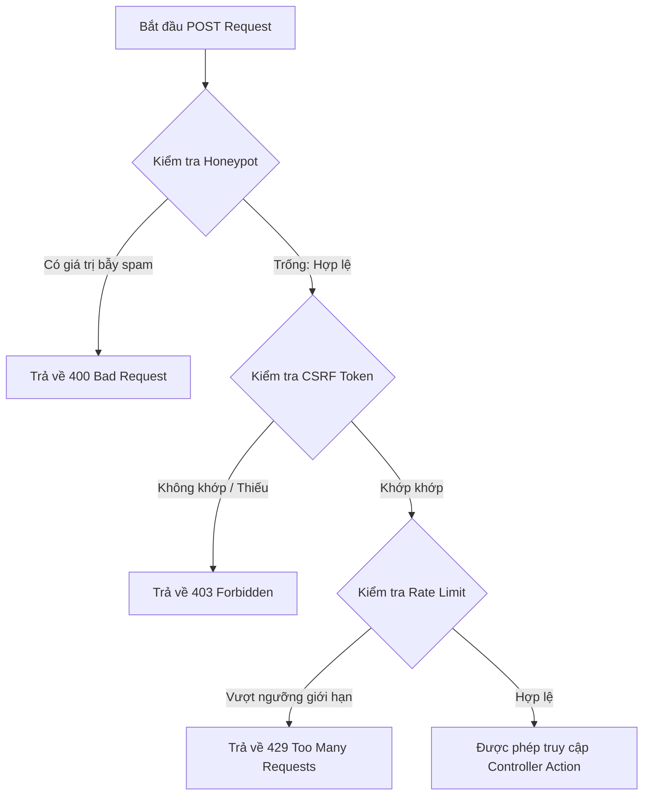

# Báo cáo Cấu trúc Core & Middleware - StudyFlow Hub

Tài liệu này mô tả chi tiết kiến trúc tầng **Core** và các **Middleware bảo mật** - xương sống vận hành toàn bộ luồng xử lý Request, Response, cơ sở dữ liệu và an ninh trong dự án **StudyFlow Hub**.

---

## 1. Sơ đồ Cấu trúc & Luồng Middleware (Mermaid Diagram)

Dưới đây là sơ đồ kiến trúc các thành phần trong thư mục `src/Core` và cách chúng tương tác:

### Luồng Kiểm tra Security Middleware khi thực hiện POST Request:

---

## 2. Chi tiết các thành phần Core

### 2.1. Database.php
*   **Mẫu thiết kế (Design Pattern):** Áp dụng **Singleton Pattern** để đảm bảo chỉ có duy nhất một kết nối cơ sở dữ liệu (connection pool thu nhỏ) được tạo ra trong suốt vòng đời của Request.
*   **Công nghệ:** Sử dụng PDO kết nối với **PostgreSQL**.
*   **Cấu hình tối ưu bảo mật:**
    *   `PDO::ATTR_ERRMODE => PDO::ERRMODE_EXCEPTION`: Kích hoạt chế độ quăng ngoại lệ khi có lỗi SQL, giúp dễ dàng try-catch và ghi log.
    *   `PDO::ATTR_DEFAULT_FETCH_MODE => PDO::FETCH_ASSOC`: Trả về dữ liệu dạng mảng liên hợp để tránh lãng phí bộ nhớ và thống nhất cách truy xuất.
    *   Sử dụng cổng mặc định `5433` làm phương án dự phòng khi môi trường cục bộ không truyền biến môi trường qua `getenv()`.

### 2.2. Request.php
*   **Vai trò:** Đóng gói toàn bộ các siêu biến toàn cầu (`$_GET`, `$_POST`, `$_SERVER`, `$_FILES`) thành một giao diện lập trình hướng đối tượng an toàn và dễ tái sử dụng.
*   **Các Method chính:**
    *   `getMethod()`: Lấy phương thức HTTP (GET, POST, v.v.).
    *   `getPath()`: Phân tích và lấy đường dẫn URL sạch (loại bỏ phần query string `?query=...`).
    *   `input(string $key, $default)`: Tự động phát hiện phương thức và đọc tham số an toàn từ `$_GET` hoặc `$_POST` kèm giá trị mặc định tránh lỗi Undefined Index.
    *   `file(string $key)`: Đọc tệp tải lên từ `$_FILES`.
    *   `isAjax()`: Xác định request gửi bằng Ajax hoặc thư viện JS bằng cách đối chiếu header `HTTP_X_REQUESTED_WITH`.

### 2.3. Response.php
*   **Vai trò:** Quản lý việc định dạng và gửi dữ liệu phản hồi về phía Client.
*   **Các tính năng nổi bật:**
    *   **Layout Engine thông minh:** Tự động phát hiện request từ **HTMX** (thông qua header `HTTP_HX_REQUEST`). Nếu là request từ HTMX hoặc có cờ `$noLayout`, Response chỉ nạp trang con (Partial View) nhằm tối ưu băng thông và tăng tốc render phía giao diện. Nếu là request thông thường, hệ thống tự nạp layout chính `views/layouts/main.php`.
    *   `json(int $status, array $data)`: Thiết lập header `Content-Type: application/json` và kết thúc luồng chạy để đảm bảo tính toàn vẹn của dữ liệu API.
    *   `redirect(string $url, int $status = 302)`: Thiết lập header Location và đóng luồng chạy bằng `exit` để tuân thủ bảo mật tuyệt đối sau redirect.
    *   `notFound()` & `methodNotAllowed()`: Xử lý chuẩn hóa các phản hồi lỗi HTTP 404 và 405 (trả kèm danh sách HTTP Methods được chấp nhận qua Header `Allow`).

### 2.4. Router.php
*   **Vai trò:** Định tuyến URL động và điều phối request đến đúng Controller và Action tương ứng.
*   **Cơ chế hoạt động:**
    *   Hỗ trợ định nghĩa URL động bằng cặp ngoặc nhọn `{param}`.
    *   Sử dụng hàm nội bộ `convertToRegex()` để dịch các route động thành biểu thức chính quy (Regex) dạng Named Capture Group: `(?P<$1>[^/]+)`.
    *   Tại thời điểm `dispatch()`, bộ định tuyến sẽ so khớp URI hiện tại, trích xuất các tham số động từ URL và truyền chúng làm đối số trực tiếp cho hàm trong Controller.
    *   Nếu URL trùng khớp nhưng sai HTTP Method, Router sẽ trả về lỗi **405 Method Not Allowed** cùng header `Allow` tương ứng.

### 2.5. Session.php
*   **Vai trò:** Quản lý bộ nhớ phiên làm việc của người dùng với các chính sách bảo mật tối đa.
*   **Cơ chế bảo mật cứng (Harden):**
    *   **Cookie Security Parameters:** Trước khi khởi chạy `session_start()`, cấu hình cookie được thiết lập nghiêm ngặt:
        *   `lifetime => 0` (hết hạn khi đóng trình duyệt).
        *   `secure => true` (chỉ truyền qua HTTPS nếu môi trường hỗ trợ).
        *   `httponly => true` (ngăn chặn XSS đánh cắp Session ID bằng Javascript).
        *   `samesite => 'Lax'` (chống tấn công CSRF).
    *   **Idle Timeout (Hết hạn phiên do không hoạt động):** Thời gian chờ tối đa là **500 giây** (`$idleLimit = 500`). Nếu người dùng không thực hiện bất kỳ hành động nào trong khoảng thời gian này, hệ thống tự động gọi `logout()` và yêu cầu đăng nhập lại.
    *   **Session Context (Chống Session Hijacking):** Khi người dùng đăng nhập thành công, hệ thống lưu trữ `HTTP_USER_AGENT` của trình duyệt vào session. Mỗi Request sau đó sẽ đối chiếu lại; nếu phát hiện trình duyệt thay đổi bất thường, phiên làm việc lập tức bị hủy bỏ.
    *   **Flash Messages:** Quản lý các tin nhắn thông báo chỉ tồn tại qua đúng 1 lần Request tiếp theo (tự động xóa ngay sau khi đọc bằng `unset`).

---

## 3. Các Middleware Bảo mật

Tầng Middleware được tổ chức độc lập để thực hiện kiểm tra an ninh trước khi Request chạm tới logic nghiệp vụ ở Controller.

### 3.1. AuthMiddleware
*   Kiểm tra trạng thái đăng nhập của người dùng.
*   Nếu chưa đăng nhập, tự động lưu thông báo lỗi dạng flash và chuyển hướng về `/login`.

### 3.2. CsrfMiddleware
*   **Mục tiêu:** Chống giả mạo Request từ các trang web độc hại khác.
*   **Cơ chế:**
    *   `generateToken()`: Tạo mã CSRF ngẫu nhiên an toàn bằng `bin2hex(random_bytes(32))` và lưu vào Session.
    *   `handle()`: Đối với mọi Request sử dụng phương thức `POST`, tiến hành kiểm tra trường ẩn `csrf_token` trong form.
    *   **Bảo mật nâng cao:** Sử dụng hàm `hash_equals()` để so khớp chuỗi token. Đây là hàm so sánh an toàn thời gian (constant-time string comparison) giúp loại bỏ nguy cơ bị khai thác lỗi **Timing Attack**.

### 3.3. HoneypotMiddleware
*   **Mục tiêu:** Chống spam bot tự động điền form hàng loạt mà không làm phiền người dùng bằng mã CAPTCHA phiền phức.
*   **Cơ chế:**
    *   Sử dụng một trường nhập liệu ẩn tên là `website_verify` (ẩn với người dùng bằng CSS).
    *   Người dùng thật sẽ không thấy và bỏ trống trường này. Spam bot quét mã HTML sẽ tự động điền giá trị ngẫu nhiên vào đó.
    *   Khi kiểm tra `POST` request, nếu phát hiện trường `website_verify` có chứa dữ liệu, Middleware lập tức hủy bỏ request và trả về lỗi `400 Bad Request`.

### 3.4. RateLimitMiddleware
*   **Mục tiêu:** Chống tấn công brute force đăng nhập, Spam đăng ký tài khoản hoặc làm nghẽn tài nguyên máy chủ.
*   **Cơ chế:**
    *   Áp dụng thuật toán **Sliding Window** đơn giản lưu vết trực tiếp trong Session của người dùng dưới dạng một mảng các mốc thời gian (timestamp).
    *   Mỗi khi có Request, Middleware tiến hành lọc bỏ các timestamp đã trượt ra ngoài khung thời gian cấu hình (`$window`).
    *   Nếu số lượng request còn lại lớn hơn hoặc bằng `$limit`, chặn ngay lập tức và trả về mã trạng thái **429 Too Many Requests**.
