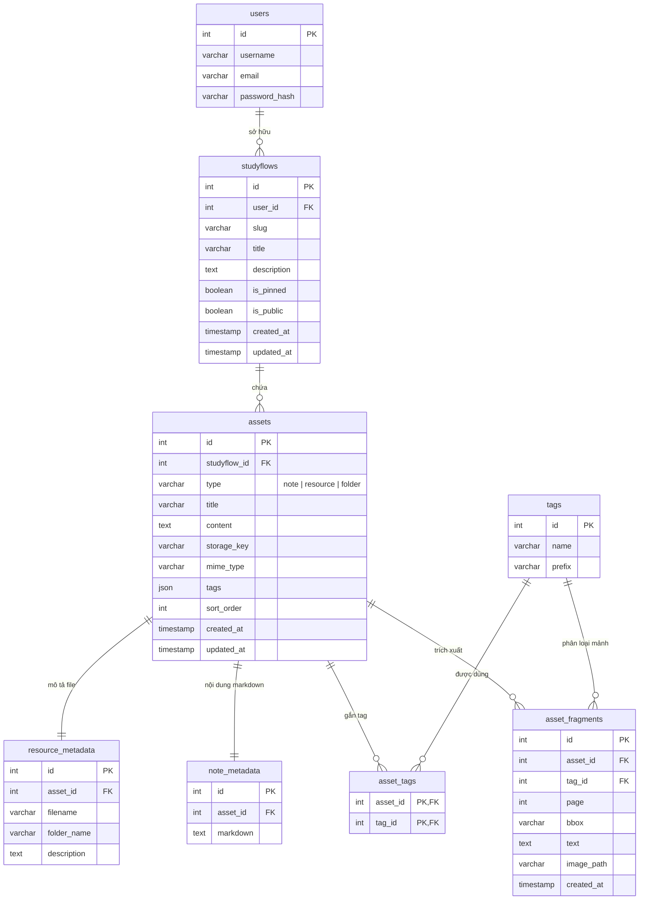

# Báo cáo Cấu trúc Repositories - StudyFlow Hub

Tài liệu này mô tả chi tiết kiến trúc tầng **Repositories** (Data Access Layer) của dự án **StudyFlow Hub**. Tầng này chịu trách nhiệm trực tiếp giao tiếp với cơ sở dữ liệu PostgreSQL qua PDO, sử dụng Prepared Statements và các Database Transaction để đảm bảo tính an toàn dữ liệu và tối ưu hiệu năng.

---

## 1. Sơ đồ Kiến trúc & Thực thể Cơ sở dữ liệu (ERD)

Dưới đây là sơ đồ thực thể mối quan hệ (ERD) của cơ sở dữ liệu PostgreSQL mà các Repository quản lý và tương tác:



---

## 2. Chi tiết các Repositories

### 2.1. UserRepository.php
*   **Vai trò:** Quản lý truy cập và đăng ký thông tin tài khoản người dùng (`users`).
*   **Các Method:**
    *   `findById(int $id)`: Tìm tài khoản bằng ID.
    *   `findByUsername(string $username)`: Tìm tài khoản bằng tên đăng nhập (dùng trong xác thực đăng nhập).
    *   `findByEmail(string $email)`: Tìm tài khoản bằng Email (dùng để kiểm tra trùng lặp khi đăng ký).
    *   `create(array $data)`: Đăng ký người dùng mới.
        *   **An toàn mật khẩu:** Sử dụng thuật toán băm mật khẩu chuẩn công nghiệp `password_hash($password, PASSWORD_BCRYPT)` trước khi lưu trữ vào trường `password_hash`.

### 2.2. StudyFlowRepository.php
*   **Vai trò:** Thực hiện các truy vấn dữ liệu liên quan đến không gian học tập (`studyflows`).
*   **Tính năng tối ưu hóa:**
    *   **Sắp xếp an toàn (Whitelist Sorting):** Kiểm tra nghiêm ngặt danh sách cột được phép sắp xếp (`created_at`, `title`, `slug`) trước khi ghép chuỗi SQL ORDER BY nhằm ngăn ngừa lỗi SQL Injection.
    *   **Phân trang hiệu năng cao:** Thực hiện đếm tổng trước bằng `COUNT(*)`, sau đó áp dụng phép lấy dữ liệu giới hạn bằng `LIMIT` và `OFFSET` thông qua cơ chế ràng buộc tham số kiểu số nguyên `PDO::PARAM_INT`.
    *   **Truy vấn lồng (Subqueries):** Method `findBySlug()` tự động tính toán số lượt Pin của từng StudyFlow thông qua subquery lồng trực tiếp trong câu lệnh SELECT.
*   **Các Method:**
    *   `findById()` / `findBySlug()`: Đọc chi tiết StudyFlow.
    *   `create()` / `update()` / `delete()`: Các thao tác ghi, cập nhật và xóa không gian.
    *   `getPaginated()`: Lấy danh sách StudyFlow có tìm kiếm (`ILIKE` không phân biệt chữ hoa thường) và phân trang.
    *   `getTrending()`: Lấy danh sách StudyFlow nổi bật ưu tiên ghim (`is_pinned`) và ngày tạo mới nhất.

### 2.3. TagRepository.php
*   **Vai trò:** Quản lý cơ sở dữ liệu nhãn phân loại (`tags`) và liên kết quan hệ.
*   **Cơ chế tiền tố Tag (Hierarchical Tags):**
    *   Hỗ trợ quản lý thẻ phân cấp qua tiền tố (ví dụ: `machine-learning/cnn` được lưu dạng prefix).
*   **Các Method:**
    *   `getAllTagsForStudyFlow(int $studyflowId)`: Lấy ra toàn bộ danh sách tag riêng biệt (DISTINCT) đang được áp dụng cho các tài nguyên trong một StudyFlow cụ thể.
    *   `findOrCreate(string $name, string $prefix)`: Kiểm tra thẻ đã tồn tại theo prefix chưa. Nếu chưa thì tiến hành thêm thẻ mới và trả về ID tự tăng thông qua mệnh đề `RETURNING id` của PostgreSQL.
    *   `searchTags(string $query)`: Tìm kiếm tag theo từ khóa, hỗ trợ thống kê số lượng tài liệu học tập (`resource_count`) và số lượng ghi chú (`note_count`) đi kèm từng thẻ.

### 2.4. AssetRepository.php
*   **Vai trò:** Quản lý bảng dữ liệu phức tạp nhất hệ thống (`assets`), liên kết thông tin tệp tin (`resource_metadata`) và ghi chú (`note_metadata`).
*   **Tính năng nâng cao:**
    *   **Giao dịch Cơ sở dữ liệu (Database Transactions):** Đối với các thao tác ghi dữ liệu nhiều bảng đồng thời (ví dụ: Tạo tài nguyên thì phải thêm vào bảng `assets` và `resource_metadata`, đồng thời tạo liên kết tag trong `asset_tags`), Repository áp dụng cấu trúc giao dịch nghiêm ngặt:
        ```php
        $this->db->beginTransaction();
        try {
            // Thực hiện ghi nhiều bảng...
            $this->db->commit();
        } catch (\Exception $e) {
            $this->db->rollBack();
            throw $e;
        }
        ```
        Điều này đảm bảo tính toàn vẹn và nhất quán của dữ liệu (Atomicity), không sinh ra dữ liệu rác nếu một trong các câu lệnh bị lỗi nửa chừng.
    *   **Kiểm tra trùng lặp tập tin:** Hàm `checkDuplicateFilename()` kiểm tra trước xem trong cùng một thư mục ảo thuộc một StudyFlow đã tồn tại file cùng tên chưa để thông báo cho người dùng.
    *   **Tìm kiếm đa nguồn (Search Everywhere):** Tìm kiếm đồng thời ghi chú, tệp tin tải lên, tags, và StudyFlow chỉ bằng một query tham số hóa duy nhất.
    *   **Sắp xếp Kéo thả (Drag & Drop sorting):** Hỗ trợ lưu trữ cấu hình sắp xếp giao diện thông qua hàm cập nhật hàng loạt thứ tự `updateAssetOrder()` dựa trên cột `sort_order`.
    *   **Quản lý Thư mục ảo (Virtual Folders):** Folder được lưu trữ giống như một Asset có type là `folder`. Khi đổi tên thư mục (`updateFolderName()`), một Transaction sẽ tự động cập nhật cả tên thư mục cha của toàn bộ các tài nguyên con bên trong.
    *   **NoteBench Fragments:** Lưu trữ tọa độ vùng chọn PDF/Image (`bbox`), trang tài liệu (`page`), ghi chú đi kèm và liên kết tag để hiển thị trên bảng ghi chú đa năng.

---

## 3. Các Nguyên Tắc An Toàn & Hiệu Năng Áp Dụng

1.  **Prepared Statements tuyệt đối:** Không có bất kỳ câu lệnh SQL nào ghép trực tiếp biến truyền từ Controller hay Service. Mọi tham số đều được bind qua mảng execute hoặc `bindValue()` (đặc biệt ép kiểu số nguyên cho LIMIT/OFFSET).
2.  **Khử trùng lặp kiểm tra Database Unique:** Phối hợp bắt ngoại lệ khi xảy ra xung đột khóa hoặc ràng buộc unique (ví dụ: bảng trung gian hoặc trùng tên đăng nhập) và chuyển đổi thành thông báo lỗi thân thiện thay vì làm sập trang.
3.  **Tách biệt Metadata:** Thông tin đặc thù của File và Note được tách thành 2 bảng quan hệ 1-1 riêng (`resource_metadata` và `note_metadata`) nhằm tối ưu cấu trúc lưu trữ và không làm phình bảng `assets` chính khi không cần đọc văn bản lớn.
