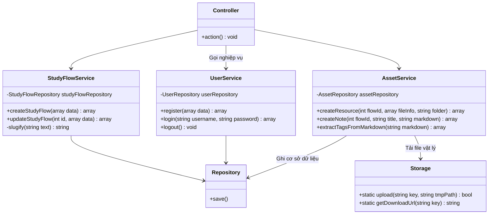
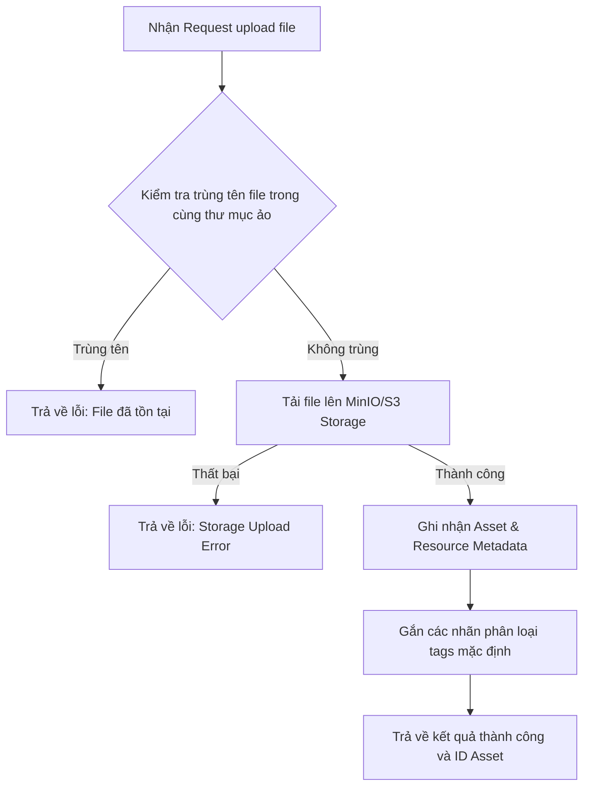

# Báo cáo Cấu trúc Services (Nghiệp vụ) - StudyFlow Hub

Tài liệu này mô tả chi tiết kiến trúc tầng **Services** (Business Logic Layer) của dự án **StudyFlow Hub**. Tầng này đóng vai trò là "bộ não" của ứng dụng, trực tiếp xử lý các quy tắc nghiệp vụ, kiểm tra ràng buộc logic, điều phối các Repositories và tích hợp dịch vụ lưu trữ bên ngoài (MinIO/S3 Storage).

---

## 1. Sơ đồ Kiến trúc & Luồng Nghiệp vụ (Mermaid Diagram)

Dưới đây là sơ đồ kiến trúc thể hiện sự tương tác giữa Controller, Service, Repository và dịch vụ lưu trữ ngoài (Storage):

### Luồng nghiệp vụ Tải tài liệu học tập (Upload Resource):

---

## 2. Chi tiết các Services

### 2.1. UserService.php
*   **Vai trò:** Kiểm soát toàn bộ quy trình nghiệp vụ liên quan đến tài khoản người dùng.
*   **Quy trình Xác thực tuần tự (Validation Sequence):**
    *   **Username:** Bắt buộc (Emptiness) $\rightarrow$ Định dạng ký tự `[a-z0-9._]` (Format) $\rightarrow$ Độ dài 3-30 ký tự (Length) $\rightarrow$ Kiểm tra trùng lặp cơ sở dữ liệu (Uniqueness).
    *   **Email:** Bắt buộc $\rightarrow$ Đúng định dạng email chuẩn `FILTER_VALIDATE_EMAIL` $\rightarrow$ Kiểm tra trùng lặp trong database.
    *   **Password:** Bắt buộc $\rightarrow$ Độ dài tối thiểu 6 ký tự.
    *   **Confirm Password:** Bắt buộc $\rightarrow$ Phải khớp chính xác với mật khẩu đã nhập.
*   **Đăng nhập & Thiết lập Session an toàn:**
    *   Sử dụng hàm băm bảo mật cao `password_verify()` để đối chiếu mật khẩu nhập vào với chuỗi hash trong database.
    *   Nếu thành công, Service khởi tạo các thông số Session cứng (Harden): lưu `user_id`, `username`, dấu vân tay trình duyệt `HTTP_USER_AGENT` và mốc thời gian hoạt động cuối cùng `last_activity_at`.

### 2.2. StudyFlowService.php
*   **Vai trò:** Quản lý vòng đời và các quy tắc thiết lập của không gian học tập.
*   **Cơ chế Tạo Slug tự động (URL-friendly string):**
    *   Nếu người dùng không nhập slug hoặc nhập không chuẩn, hàm `slugify()` sẽ sử dụng regex chuyển đổi ký tự có dấu thành không dấu (sử dụng `TRANSLIT` của thư viện `iconv`), loại bỏ ký tự đặc biệt, chuyển thành chữ thường và ngăn cách bằng dấu gạch ngang (`-`).
    *   Ví dụ: `"Machine Learning nâng cao!"` $\rightarrow$ `"machine-learning-nang-cao"`.
    *   Tiến hành kiểm tra duy nhất (Uniqueness) của slug trong DB để tránh xung đột URL trùng lặp.

### 2.3. TagService.php
*   **Vai trò:** Lớp dịch vụ mỏng cung cấp giao diện trung gian cho việc lấy thẻ của không gian học tập và thực hiện tìm kiếm tag tự động.

### 2.4. AssetService.php
*   **Vai trò:** Quản lý nghiệp vụ lưu trữ tài nguyên học tập, bao gồm ghi chú, tệp tin tải lên, cấu trúc thư mục ảo và tính năng trích xuất PDF NoteBench.
*   **Các Nghiệp vụ Đặc thù:**
    *   **Tải tệp tin lên hệ thống (Resource Upload):**
        *   Tạo đường dẫn lưu trữ độc bản dựa theo cấu trúc: `flows/{studyflow_id}/{folder_name}/{timestamp}_{filename}`.
        *   Tải trực tiếp lên S3/MinIO thông qua helper class `Storage::upload()`.
        *   Nếu thành công, lưu dữ liệu Metadata tương ứng và gán nhãn tags mặc định.
    *   **Tự động gắn tag qua phân tích nội dung (Auto-tagging):**
        *   Khi lưu ghi chú, Service sử dụng hàm `extractTagsFromMarkdown()` quét toàn bộ văn bản bằng Regex để tìm các từ khóa có tiền tố `@` (ví dụ `@machine-learning/cnn`).
        *   Tự động lọc bỏ các liên kết transclusion tệp tin (như `.pdf`, `.png`) hoặc ký hiệu trang để trích xuất ra các tag thực tế.
        *   Nếu tìm thấy tag trùng khớp trong database, tự động ánh xạ tag đó với note. Nếu chưa có, tự sinh tag mới.
    *   **Quản lý Thư mục ảo & Kéo thả:**
        *   Hỗ trợ đổi tên thư mục và đồng bộ đổi tên đường dẫn của toàn bộ tệp tin bên trong thư mục đó thông qua Transaction của Repository.
        *   Xử lý di chuyển tài liệu (`moveAsset`) và sắp xếp kéo thả (`reorderAssets`).

---

## 3. Các Nguyên Tắc Thiết Kế Thực Tiễn (Best Practices)

1.  **Trả về kết quả có cấu trúc (Predictable Result Pattern):** Các hàm xử lý ghi nhận dữ liệu trong Service luôn trả về một mảng có cấu trúc đồng nhất:
    *   Thành công: `['success' => true, 'id' => $id]`
    *   Thất bại: `['success' => false, 'error' => 'Thông điệp lỗi thân thiện']` hoặc `['errors' => [...]]` (dành cho form nhiều lỗi).
    *   Điều này giúp Controller cực kỳ dễ điều phối và đưa ra phản hồi phù hợp.
2.  **Tách biệt Cơ sở hạ tầng (Infrastructure Separation):** Service không trực tiếp gọi đến PDO hay viết câu lệnh SQL. Mọi thao tác ghi DB được thực hiện qua Repository, còn lưu trữ vật lý được gọi qua lớp Adapter `Storage`.
3.  **Tự động sửa lỗi & Định dạng (Normalization):** Các đầu vào dạng text đều được lọc bằng hàm `trim()` và chuyển đổi định dạng thích hợp trước khi xử lý sâu hơn để đảm bảo tính nhất quán của dữ liệu.
