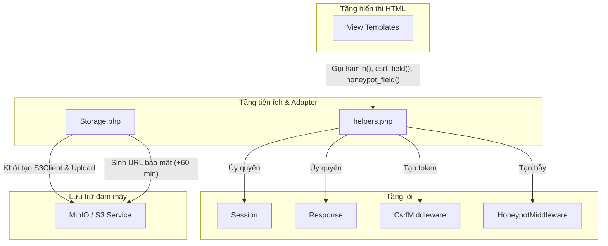

# Báo cáo Cấu trúc Support (Tiện ích & Adapter) - StudyFlow Hub

Tài liệu này mô tả chi tiết kiến trúc tầng **Support** của dự án **StudyFlow Hub**. Tầng này cung cấp các Adapter kết nối với dịch vụ bên ngoài (AWS S3/MinIO Object Storage) và các hàm tiện ích toàn cục (Global Helpers) giúp đơn giản hóa cú pháp lập trình, bảo vệ an toàn XSS và tự động phát sinh các trường bảo mật trên View.

---

## 1. Sơ đồ Kiến trúc & Luồng Tương tác (Mermaid Diagram)

Dưới đây là sơ đồ thể hiện vị trí của tầng Support làm nhiệm vụ bắc cầu giữa View, Controller và các dịch vụ lưu trữ ngoài:



---

## 2. Chi tiết các thành phần Support

### 2.1. Storage.php (Object Storage Adapter)
*   **Vai trò:** Đóng vai trò là Client Adapter giao tiếp với các dịch vụ lưu trữ đối tượng tương thích với giao thức S3 (như AWS S3, MinIO).
*   **Cơ chế hoạt động:**
    *   **Singleton Client:** Sử dụng phương thức `getClient()` để tạo và tái sử dụng thực thể `S3Client` của AWS SDK.
    *   **Tự động khởi tạo Bucket (Self-healing):** Hàm `ensureBucketExists()` tự động kiểm tra sự tồn tại của bucket lưu trữ (`studyflow-assets`). Nếu chưa có (ví dụ: khi mới deploy dự án ở môi trường mới), hệ thống tự động gọi lệnh tạo bucket.
    *   **Upload tệp tin:** Hàm `upload()` nhận đường dẫn tệp tạm thời của PHP và đẩy lên cloud/storage server qua phương thức `putObject`.
    *   **Presigned Download URLs (Liên kết tải xuống có thời hạn):**
        *   Tài nguyên học tập tải lên MinIO/S3 không được mở công khai (Private) để tránh rò rỉ dữ liệu.
        *   Khi người dùng xem hoặc tải file, hàm `getDownloadUrl()` sử dụng API `createPresignedRequest` để sinh ra một URL truy cập tạm thời có hiệu lực trong vòng **60 phút** (`+60 minutes`).
        *   Hỗ trợ cấu hình Endpoint nội bộ cho Server (`http://minio:9000`) và Endpoint ngoại vi cho Client (`http://localhost:9002`) thông qua biến môi trường để giải quyết vấn đề phân giải IP (NAT/Docker network).

### 2.2. helpers.php (Global Utilities)
*   **Vai trò:** Cung cấp các hàm tiện ích toàn cục được nạp sẵn vào hệ thống để viết code ngắn gọn hơn trên View và Controller.
*   **Các hàm helper cốt lõi:**
    *   `h(?string $value): string`
        *   Hàm viết tắt của `htmlspecialchars()`.
        *   **Bảo mật:** Bắt buộc áp dụng khi echo bất kỳ biến động nào trên View để ngăn chặn triệt để tấn công XSS (Cross-Site Scripting). Sử dụng flag `ENT_QUOTES` và mã hóa `UTF-8`.
    *   `redirect(string $path): void`
        *   Hàm viết tắt để chuyển hướng trang nhanh.
    *   `flash_set()` / `flash_get()`
        *   Hàm viết tắt giao tiếp với bộ quản lý Flash Message của `Session` (tự động biến mất sau khi đọc).
    *   `is_logged_in()`
        *   Kiểm tra nhanh xem người dùng đã đăng nhập chưa.
    *   `csrf_token()`
        *   Lấy mã token CSRF hiện tại của phiên làm việc.
    *   `csrf_field(): string`
        *   Tự động sinh thẻ HTML ẩn chứa token CSRF để chèn vào form: `<input type="hidden" name="csrf_token" value="...">`.
    *   `honeypot_field(): string`
        *   Tự động sinh khối HTML ẩn làm bẫy chống bot spam:
            ```html
            <div style="display:none !important;">
                <input type="text" name="website_verify" value="" tabindex="-1" autocomplete="off">
            </div>
            ```
        *   Thiết lập thuộc tính `tabindex="-1"` để ngăn người dùng dùng phím Tab di chuyển vào, và `autocomplete="off"` để trình duyệt không tự động điền thông tin.

---

## 3. Lợi ích của Kiến trúc Tầng Support

1.  **Dọn dẹp mã nguồn trên View:** Thay vì viết các thẻ input bảo mật cồng kềnh hay gọi các class Namespace dài dòng, lập trình viên chỉ cần gọi `<?= csrf_field() ?>` hoặc `<?= honeypot_field() ?>` bên trong form.
2.  **Khả năng thay thế linh hoạt:** Nếu trong tương lai dự án chuyển từ MinIO sang AWS S3 thực tế hoặc Google Cloud Storage, lập trình viên chỉ cần cập nhật cấu hình thông số cấu hình hoặc sửa đổi duy nhất tệp tin `Storage.php` mà không cần sửa đổi bất kỳ dòng code nào ở tầng Service hay Controller.
3.  **Tăng cường độ an toàn mặc định:** Hàm `h()` cực kỳ ngắn gọn giúp khuyến khích lập trình viên luôn escape dữ liệu khi hiển thị trên màn hình.
