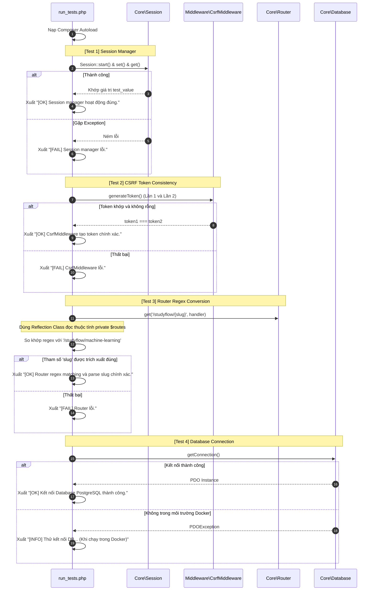

# Báo cáo Cấu trúc Tests (Kiểm thử Tự động) - StudyFlow Hub

Tài liệu này mô tả chi tiết hệ thống **Tests** (Kiểm thử tự động các thành phần lõi) trong dự án **StudyFlow Hub**. Dự án hiện tại tích hợp một bộ kiểm thử tự động gọn nhẹ (Lightweight Test Suite) tại `src/tests/run_tests.php` để nhanh chóng xác minh tính đúng đắn của các mô-đun lõi mà không cần phụ thuộc vào các thư viện bên thứ ba cồng kềnh.

---

## 1. Sơ đồ Hoạt động của Test Runner (Mermaid Diagram)

Dưới đây là sơ đồ quy trình hoạt động của Test Runner khi thực thi các kịch bản kiểm thử:



---

## 2. Chi tiết các Bài Kiểm thử (Test Cases)

### 2.1. Kiểm thử Quản lý Phiên làm việc (Session Manager)
*   **Mục tiêu:** Đảm bảo hệ thống Session của dự án hoạt động ổn định, ghi và đọc dữ liệu nhất quán.
*   **Cách thức kiểm tra:**
    *   Gọi `Session::start()`.
    *   Ghi một cặp key-value tạm thời: `'test_key'` $\rightarrow$ `'test_value'`.
    *   Đọc lại giá trị bằng `Session::get('test_key')` và đối sánh chuỗi.
    *   Bắt mọi lỗi `\Throwable` phát sinh (ví dụ: lỗi headers already sent hoặc cấu hình session cookie).

### 2.2. Kiểm thử Tính đồng bộ CSRF Token (CSRF Consistency)
*   **Mục tiêu:** Xác minh token CSRF không bị tạo mới liên tục trên mỗi yêu cầu đọc trong cùng một phiên, giúp tránh lỗi lệch token khi render nhiều form trên cùng giao diện.
*   **Cách thức kiểm tra:**
    *   Sinh token lần 1: `CsrfMiddleware::generateToken()`.
    *   Sinh token lần 2: `CsrfMiddleware::generateToken()`.
    *   Đảm bảo cả hai mã token không được rỗng và phải khớp hoàn toàn với nhau (`$token1 === $token2`).

### 2.3. Kiểm thử Biểu thức chính quy Bộ định tuyến (Router Regex & Reflection)
*   **Mục tiêu:** Xác thực thuật toán chuyển đổi URL động dạng thân thiện thành biểu thức chính quy (Regex) và khả năng trích xuất chính xác các tham số truyền vào URL.
*   **Cách thức kiểm tra đặc biệt:**
    *   Đăng ký một route thử nghiệm: `/studyflow/{slug}` mapped tới `StudyFlowController@show`.
    *   **Áp dụng kỹ thuật Reflection:** Do thuộc tính `$routes` trong lớp `Router` được khai báo ở chế độ `private`, mã kiểm thử sử dụng `ReflectionClass` để vượt qua giới hạn truy cập, thiết lập `setAccessible(true)` để lấy ra mảng cấu trúc route đã được dịch.
    *   Thực hiện khớp thử nghiệm mẫu URL thực tế `/studyflow/machine-learning`.
    *   Xác minh xem Named Capture Group trong Regex có bắt được khóa `slug` có giá trị là `'machine-learning'` hay không.

### 2.4. Kiểm thử Kết nối Cơ sở dữ liệu (PostgreSQL Connection)
*   **Mục tiêu:** Xác nhận kết nối PDO PostgreSQL hoạt động bình thường với các thông số từ biến môi trường.
*   **Cơ chế thích ứng thông minh:**
    *   Mã kiểm thử thực hiện gọi hàm `Database::getConnection()`.
    *   Nếu đang chạy ngoài môi trường Docker (ví dụ: máy cục bộ chưa mở cổng PostgreSQL), hàm sẽ ném ngoại lệ. Kịch bản kiểm thử bắt ngoại lệ này và đưa ra cảnh báo dạng `[INFO]` thay vì dừng đột ngột (crash) toàn bộ tiến trình chạy test, đảm bảo quy trình CI/CD không bị gián đoạn oan.

---

## 3. Hướng dẫn Khởi chạy Kiểm thử

Lập trình viên có thể chạy bộ kiểm thử trực tiếp bằng Terminal từ thư mục gốc của dự án `studyflow-hub` thông qua câu lệnh:

```bash
php src/tests/run_tests.php
```

### Kết quả xuất ra màn hình mong đợi (Expected Output):

```text
=== CHẠY KIỂM THỬ TỰ ĐỘNG CORE MODULES ===

[OK] Session manager hoạt động đúng.
[OK] CsrfMiddleware tạo token chính xác và nhất quán.
[OK] Router regex matching và parse slug chính xác.
[OK] Kết nối Database PostgreSQL thành công.

=== HOÀN TẤT KIỂM THỬ ===
```
